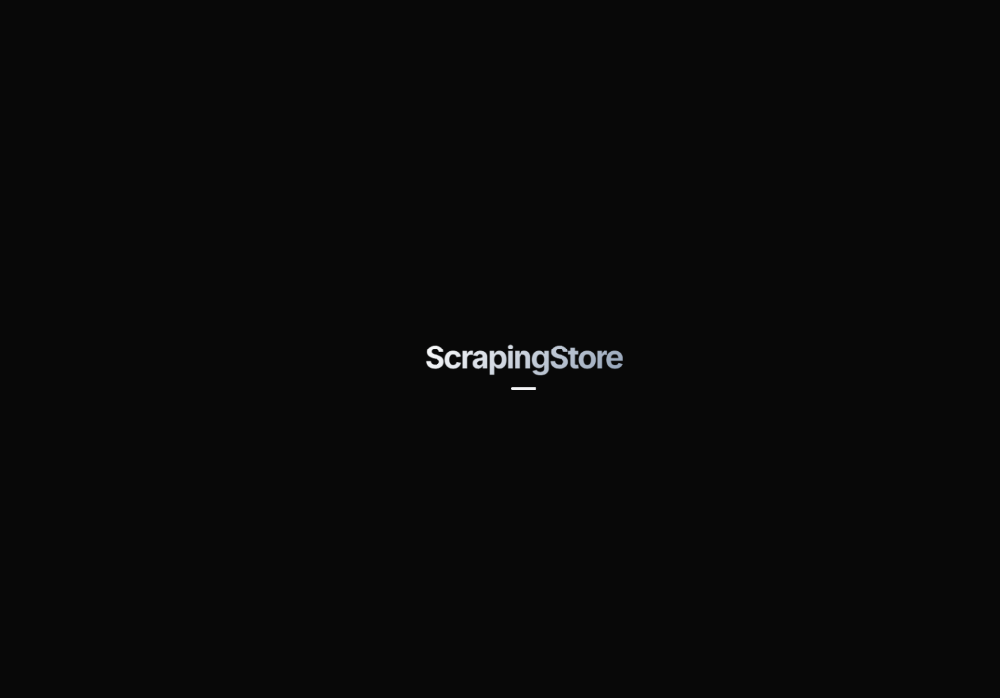
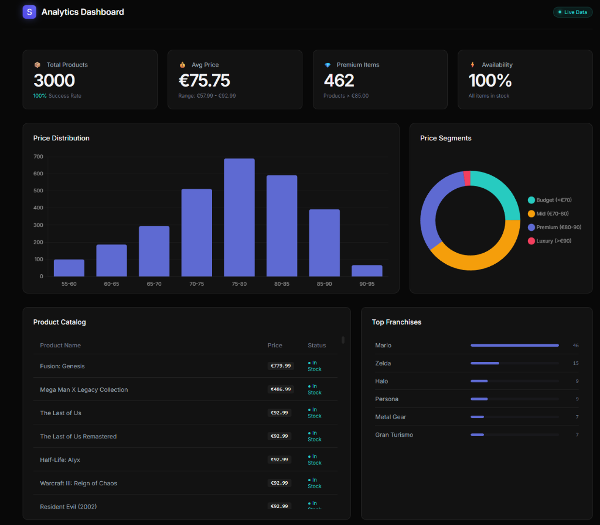
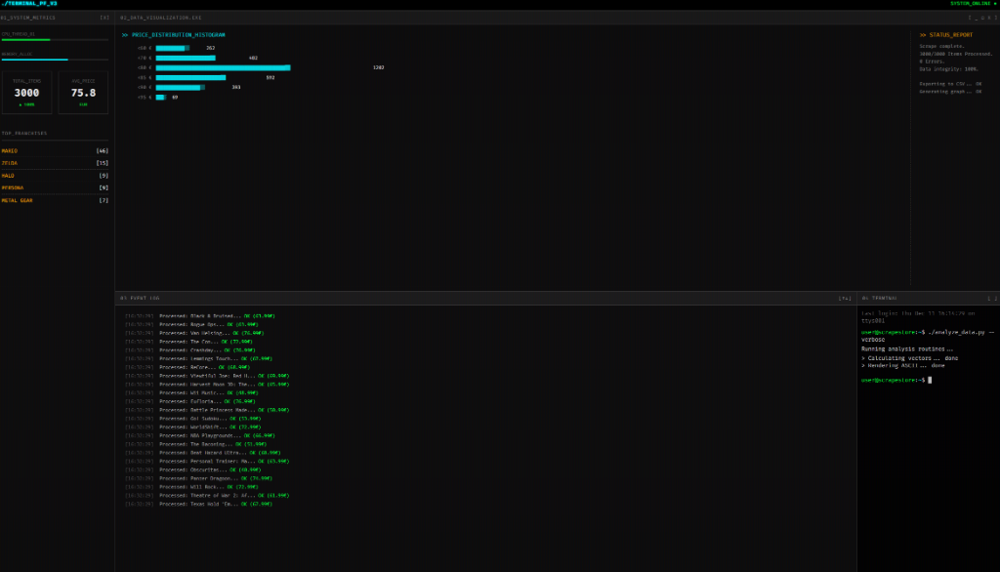

# 🛒 Web Scraping Portfolio Project

<p align="center">
  
</p>


A complete end-to-end data engineering portfolio project demonstrating web scraping, data cleaning, visualization, and Power BI integration.

### 🚀 **[Live Demo](https://tzii.github.io/ScrapingStore/)** | **[Terminal View](https://tzii.github.io/ScrapingStore/dashboard_terminal.html)**

## 📸 Dashboard Preview



> **Made by Simone** — Student Project

---

## ✨ Features & Skills Demonstrated

| Category | Technologies & Techniques |
|----------|---------------------------|
| **Web Scraping** | Playwright (headless browser), BeautifulSoup, async/await, pagination handling |
| **Data Cleaning** | Pandas, regex, currency parsing, duplicate removal, data validation |
| **Visualization** | Plotly Express, interactive dashboards, responsive HTML exports |
| **Data Export** | Power BI-ready CSV (UTF-8 BOM), automated pipeline |

---

## 🏗️ Architecture

```mermaid
graph TD
    User[User] --> CLI[CLI (main.py)]
    CLI --> Scraper[Scraper Module]
    Scraper -->|Raw HTML| Cleaner[Cleaner Module]
    Cleaner -->|Product Objects| DB[Database (SQLModel)]
    DB -->|Query| Dashboard[Dashboard Generator]
    DB -->|Export| CSV[CSV File]
    Dashboard -->|HTML| Browser[Browser View]
```

---

## 🎯 Project Overview

This project scrapes product data from the [Oxylabs Sandbox E-commerce](https://sandbox.oxylabs.io/products) website and processes it through a complete data pipeline:

1. **Web Scraping** - Extract ~3000 products using Playwright browser automation
2. **Data Cleaning** - Process and transform raw data with Pandas
3. **Visualization** - Create interactive charts with Plotly Express
4. **Power BI Export** - Generate analysis-ready CSV files

---

## 📁 Project Structure

```
ScrapingStore/
├── scraper/
│   ├── __init__.py
│   ├── base.py                     # Base scraper class
│   ├── product_scraper.py          # BeautifulSoup scraper (static)
│   └── product_scraper_browser.py  # Playwright scraper (dynamic JS)
├── cleaning/
│   ├── __init__.py
│   └── data_cleaner.py             # Pandas data cleaning pipeline
├── visualization/
│   ├── __init__.py
│   ├── charts.py                   # Plotly chart generators
│   ├── dashboard_generator.py      # Modern dashboard template
│   ├── terminal_dashboard_generator.py
│   └── templates/                  # Jinja2 HTML templates
├── tests/                          # pytest test suite
│   ├── test_scraper.py
│   └── test_data_cleaner.py
├── data/                           # Output directory (gitignored)
├── config.py                       # Centralized configuration
├── database.py                     # SQLModel database manager
├── models.py                       # Pydantic/SQLModel data models
├── logger.py                       # Logging configuration
├── main.py                         # CLI pipeline orchestrator
├── requirements.txt
├── LICENSE
└── README.md
```

---

## 🚀 Quick Start

### Prerequisites

- Python 3.9 or higher
- pip package manager

### Installation

```bash
# Clone the repository
git clone https://github.com/tzii/ScrapingStore.git
cd ScrapingStore

# Create virtual environment (recommended)
python -m venv venv
source venv/bin/activate  # On Windows: venv\Scripts\activate

# Install dependencies
pip install -r requirements.txt

# Install Playwright browsers
playwright install chromium
```

### Running the Pipeline

```bash
# Quick test: scrape 2 pages (~64 products)
python main.py --pages 2

# Default: scrape 10 pages (~320 products)
python main.py

# Scrape all pages (~3000 products)
python main.py --all

# Custom delay between requests (be respectful!)
python main.py --pages 10 --delay 2.0
```


### Configuration

You can configure the scraper using a `.env` file (copy from `.env.example` if available) or environment variables:

```bash
BASE_URL="https://sandbox.oxylabs.io/products"
MAX_RETRIES=3
DEFAULT_TIMEOUT=30
DB_NAME="products.db"
```

### Running Tests

To ensure everything is working correctly:

```bash
pytest
```

---

## 📊 Output Files

| File | Description |
|------|-------------|
| `products_raw.csv` | Raw scraped data |
| `products_cleaned.csv` | Cleaned and transformed data |
| `products_powerbi.csv` | Power BI-ready export (UTF-8 BOM) |
| `dashboard.html` | Interactive modern dashboard |
| `dashboard_terminal.html` | Terminal-style dashboard |
| `charts/*.html` | Individual chart files |

---

## 🔧 Module Details

### Web Scraper (`scraper/`)

- **Playwright-based** headless browser for JavaScript-rendered content
- Async/await for efficient concurrent scraping
- Rate limiting to respect server resources
- Automatic pagination handling
- Robust error handling and retry logic

### Data Cleaner (`cleaning/data_cleaner.py`)

- European price format parsing (`88,99 €` → `88.99`)
- Availability status standardization
- Missing value handling with configurable strategies
- Duplicate detection and removal
- Automatic price categorization (Budget/Mid-Range/Premium/Luxury)

### Visualization (`visualization/charts.py`)

- Price distribution histogram with statistics
- Price by availability box plots
- Price category bar charts
- Availability pie/donut charts
- Combined interactive dashboard

#### Terminal Dashboard Mode
The project also includes a retro-style terminal dashboard for CLI enthusiasts:



---

## 📈 Power BI Integration

The `products_powerbi.csv` file is formatted for seamless Power BI import:

1. Open Power BI Desktop
2. Click **Get Data** → **Text/CSV**
3. Select `data/products_powerbi.csv`
4. Data types will be auto-detected

---

## 🛠️ Technologies

- **Python 3.9+**
- **Playwright** - Browser automation for JS-rendered sites
- **BeautifulSoup4** - HTML parsing
- **Requests** - HTTP client
- **Pandas** - Data manipulation
- **Plotly Express** - Interactive visualizations
- **Jinja2** - HTML templating

---

## 📝 License

MIT License - see [LICENSE](LICENSE) for details.

---

<p align="center">
  <b>Made by Simone</b> • Student Project • 2025
</p>
