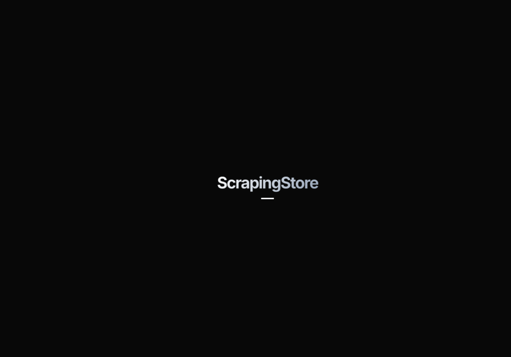
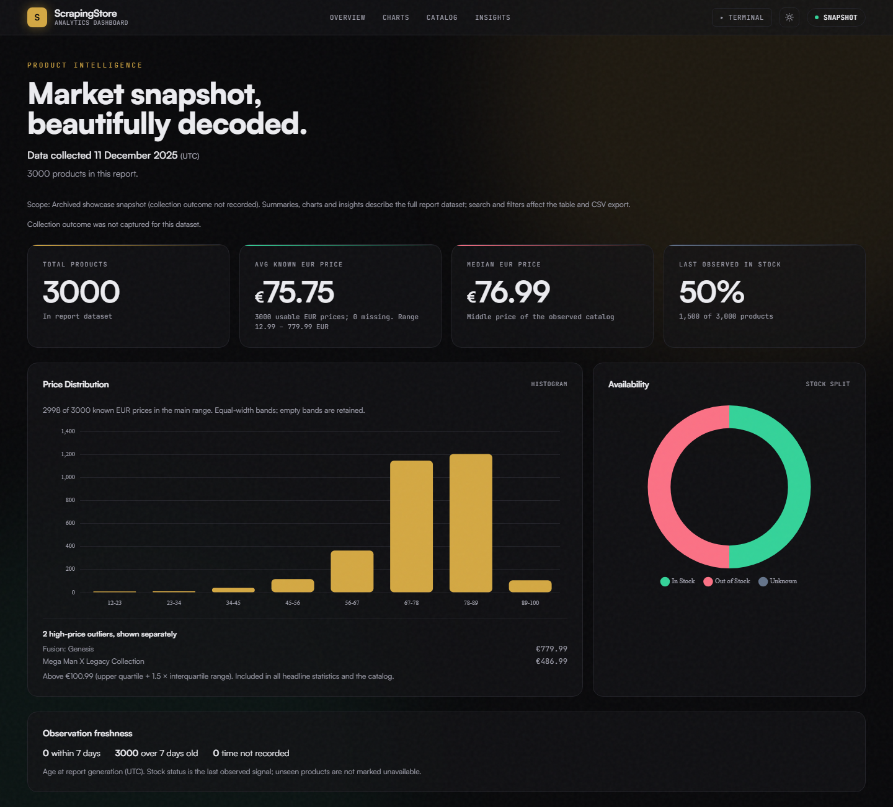
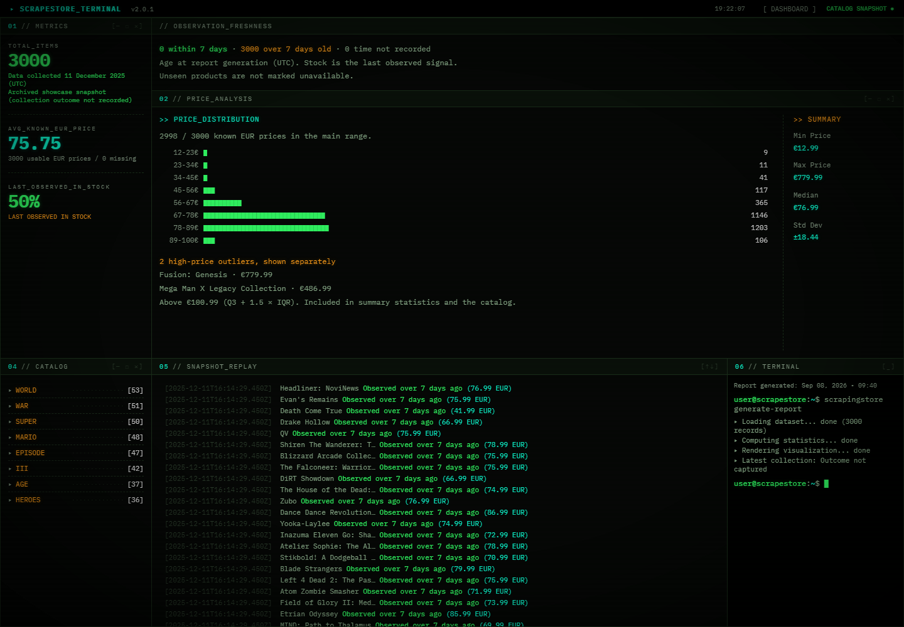

# 🛒 Web Scraping Portfolio Project

<p align="center">
  
</p>


A complete end-to-end data engineering portfolio project demonstrating web scraping, data cleaning, visualization, and Power BI integration.

### 🚀 **[Live Demo](https://tzii.github.io/ScrapingStore/)** | **[Terminal View](https://tzii.github.io/ScrapingStore/dashboard_terminal.html)**

## 📸 Dashboard Preview



> **Made by Simone** — Student Project

---

## ✨ Features & Skills Demonstrated

| Category | Technologies & Techniques |
|----------|---------------------------|
| **Web Scraping** | Playwright (headless browser), BeautifulSoup, async/await, pagination handling |
| **Data Cleaning** | Pandas, numpy, duplicate removal, data normalization |
| **Visualization** | Chart.js, Grid.js, Alpine.js, Jinja2 HTML dashboards (modern + terminal) |
| **Database** | SQLModel ORM, SQLite, upsert logic |
| **Data Export** | Power BI-ready CSV (UTF-8 BOM), automated pipeline |
| **DevOps** | Docker, GitHub Actions CI, pre-commit hooks, pytest |

---

## 🏗️ Architecture

```mermaid
graph TD
    User[User] --> CLI[CLI (main.py)]
    CLI --> Scraper[Scraper Module]
    Scraper -->|Structured Products| Cleaner[Cleaner Module]
    Cleaner -->|Validated Products| DB[Database (SQLModel)]
    DB -->|Query| Dashboard[Dashboard Generator]
    DB -->|Export| CSV[CSV File]
    Dashboard -->|HTML| Browser[Browser View]
```

---

## 🎯 Project Overview

This project scrapes product data from the [Oxylabs Sandbox E-commerce](https://sandbox.oxylabs.io/products) website and processes it through a complete data pipeline:

1. **Web Scraping** - Extract ~3000 products using Playwright browser automation
2. **Data Cleaning** - Normalize and deduplicate data with Pandas
3. **Visualization** - Interactive dashboards with Chart.js and Grid.js
4. **Power BI Export** - Generate analysis-ready CSV files

---

## 📁 Project Structure

```
ScrapingStore/
├── scraper/
│   ├── __init__.py
│   ├── base.py                     # Abstract base scraper class
│   ├── product_scraper.py          # BeautifulSoup scraper (static HTML)
│   └── product_scraper_browser.py  # Playwright scraper (JS-rendered pages)
├── cleaning/
│   ├── __init__.py
│   └── data_cleaner.py             # Pandas data cleaning pipeline
├── visualization/
│   ├── __init__.py
│   ├── dashboard_generator.py      # Modern dashboard (Tailwind/Chart.js)
│   ├── terminal_dashboard_generator.py  # Retro terminal dashboard
│   └── templates/                  # Jinja2 HTML templates
├── tests/                          # pytest test suite
│   ├── conftest.py                 # Shared fixtures
│   ├── test_scraper.py
│   ├── test_cleaner.py
│   ├── test_database.py
│   ├── test_models.py
│   └── test_cli.py
├── data/                           # Output directory (gitignored)
├── config.py                       # Centralized configuration
├── database.py                     # SQLModel database manager
├── models.py                       # Pydantic/SQLModel data models with validation
├── logger.py                       # Logging configuration (Rich)
├── main.py                         # CLI pipeline orchestrator (Typer)
├── requirements.txt
├── Dockerfile
├── docker-compose.yml
└── README.md
```

---

## 🚀 Quick Start

### Prerequisites

- Python 3.9 or higher
- pip package manager

### Installation

```bash
# Clone the repository
git clone https://github.com/tzii/ScrapingStore.git
cd ScrapingStore

# Create virtual environment (recommended)
python -m venv venv
source venv/bin/activate  # On Windows: venv\Scripts\activate

# Install dependencies
pip install -r requirements.txt

# Install Playwright browsers
playwright install chromium
```

### Running the Pipeline

```bash
# Quick test: scrape 2 pages (~64 products)
python main.py scrape --pages 2

# Default: scrape 10 pages (~320 products)
python main.py scrape

# Scrape all pages (~3000 products)
python main.py scrape --all

# Custom delay between requests (be respectful!)
python main.py scrape --pages 10 --delay 2.0

# Use browser scraper for JS-rendered pages
python main.py scrape --type browser --pages 5
```

### Other Commands

```bash
# Export existing data to Power BI CSV
python main.py export

# Regenerate dashboards from existing data
python main.py generate-report
```

### Configuration

You can configure the scraper using a `.env` file (copy from `.env.example`):

```bash
BASE_URL="https://sandbox.oxylabs.io/products"
MAX_RETRIES=3
DEFAULT_TIMEOUT=30
DB_NAME="products.db"
```

### Running Tests

```bash
pytest

# With coverage report
pytest --cov=scraper --cov=cleaning --cov=visualization --cov-report=term-missing
```

---

## 📊 Output Files

| File | Description |
|------|-------------|
| `products_powerbi.csv` | Power BI-ready export (UTF-8 BOM) |
| `dashboard.html` | Interactive modern dashboard |
| `dashboard_terminal.html` | Terminal-style dashboard |

---

## 🔧 Module Details

### Web Scraper (`scraper/`)

- **Two scraper implementations**: Static (BeautifulSoup) and Browser (Playwright)
- Structured data extraction (price, availability, images) at scrape time
- Async/await with concurrency limiting (semaphore) for browser scraper
- Rate limiting and configurable delay between requests
- Automatic pagination with consecutive-empty-page detection
- Retry logic with exponential backoff (static scraper)

### Data Cleaner (`cleaning/data_cleaner.py`)

- Availability status normalization (`In Stock` / `Out of Stock` / `Unknown`)
- Duplicate detection and removal by product name
- Name whitespace trimming
- Vectorized operations via Pandas + NumPy for performance

### Visualization (`visualization/`)

- **Modern Dashboard**: Tailwind CSS, Chart.js (price distribution, segment doughnut), Grid.js (searchable/sortable product table), Alpine.js (dark mode toggle)
- **Terminal Dashboard**: Retro CRT-style with ASCII bar charts, auto-calculated KPIs
- Auto-detected franchise/keyword analysis (no hardcoded keywords)

### Data Models (`models.py`)

- SQLModel/Pydantic hybrid with field validators
- Price must be non-negative; name must not be empty
- Automatic UTC timestamps on creation

#### Terminal Dashboard Mode
The project also includes a retro-style terminal dashboard for CLI enthusiasts:



---

## 📈 Power BI Integration

The `products_powerbi.csv` file is formatted for seamless Power BI import:

1. Open Power BI Desktop
2. Click **Get Data** → **Text/CSV**
3. Select `data/products_powerbi.csv`
4. Data types will be auto-detected

---

## 🤝 Responsible Scraping

This project targets a public scraping sandbox explicitly intended for practice. When adapting it to other sites:

- **Check `robots.txt` and the site's Terms of Service** before scraping
- **Keep a delay between requests** (`--delay`, default 1s) and do not raise the browser concurrency limit
- **Identify your client honestly** via the `USER_AGENT` env var where appropriate
- **Never scrape private, personal, or paywalled data**, and never bypass authentication or captchas
- **Fail gracefully**: both scrapers back off and stop after repeated failures instead of hammering the server

---

## ⚠️ Known Limitations

- **Static scraper vs. JS-rendered sites**: The `static` scraper uses `requests` + BeautifulSoup, which cannot execute JavaScript. The target sandbox site is JS-rendered, so **use `--type browser`** for actual scraping. The static scraper is included to demonstrate the pattern and works with server-rendered HTML.
- **Upsert by name**: Products are matched by `name` during upsert. If two genuinely different products share the same name, only the latest will be kept.
- **Sandbox-specific**: The CSS selectors (`div.product-card`, `h4`) are tailored to the Oxylabs sandbox. Adapting to a different site would require updating the selectors.

---

## 🛠️ Technologies

- **Python 3.9+**
- **Playwright** - Browser automation for JS-rendered sites
- **BeautifulSoup4** - HTML parsing
- **Requests** - HTTP client
- **Pandas / NumPy** - Data manipulation
- **SQLModel / Pydantic** - ORM and data validation
- **Typer / Rich** - CLI interface
- **Chart.js / Grid.js / Alpine.js** - Frontend visualization
- **Jinja2** - HTML templating
- **Docker** - Containerization
- **GitHub Actions** - CI/CD

---

## 📝 License

MIT License - see [LICENSE](LICENSE) for details.

---

<p align="center">
  <b>Made by Simone</b> • Student Project • 2025
</p>
